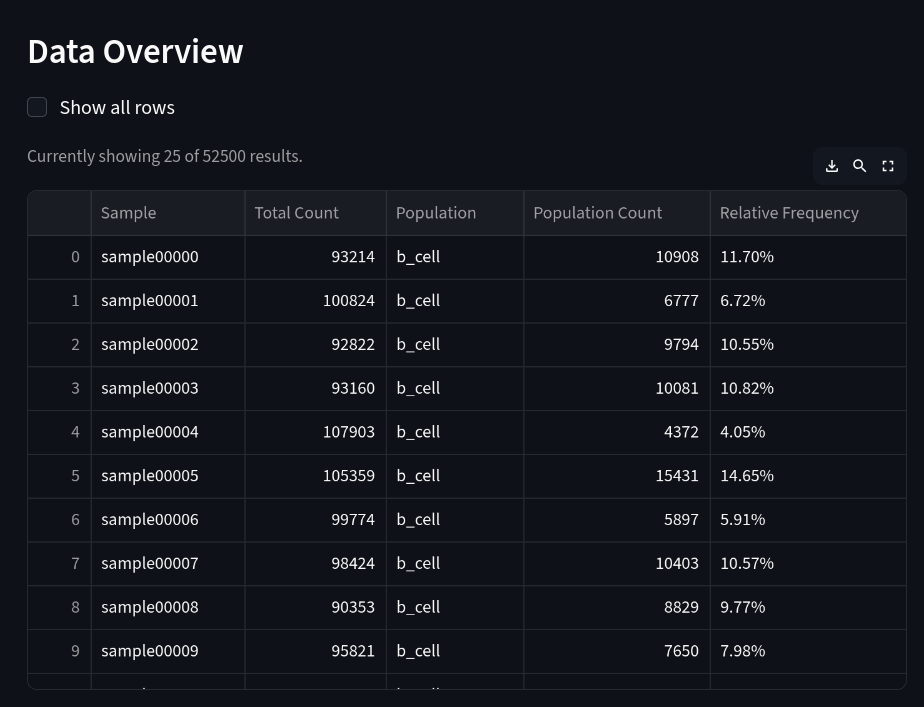
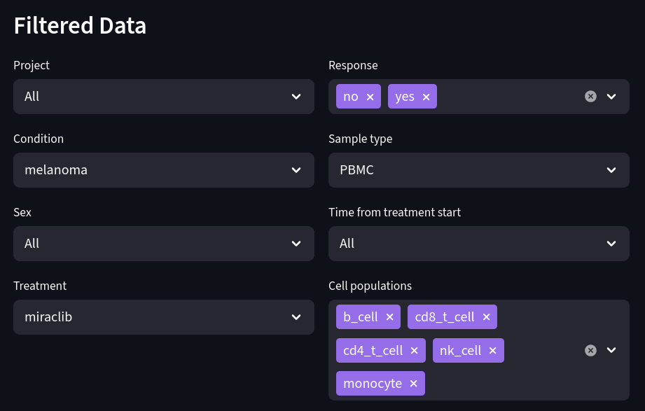
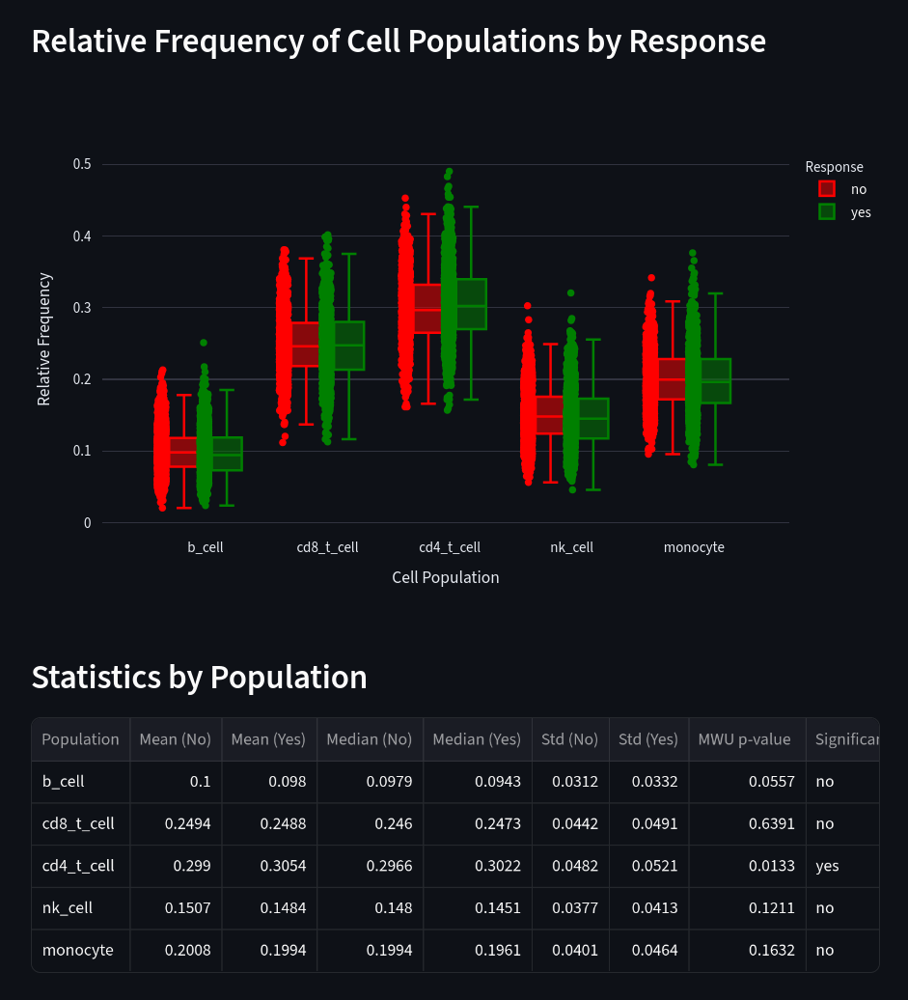
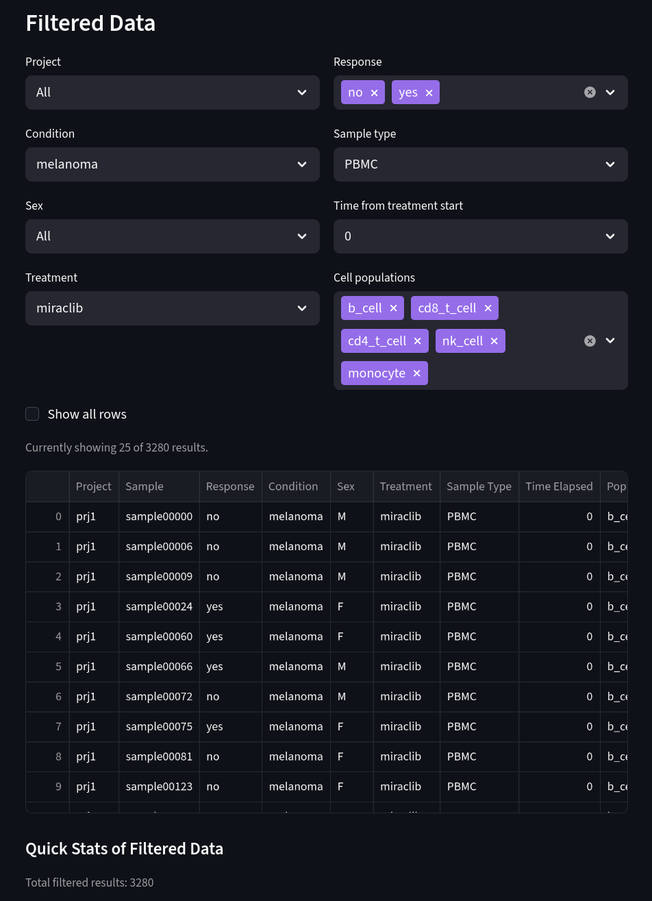
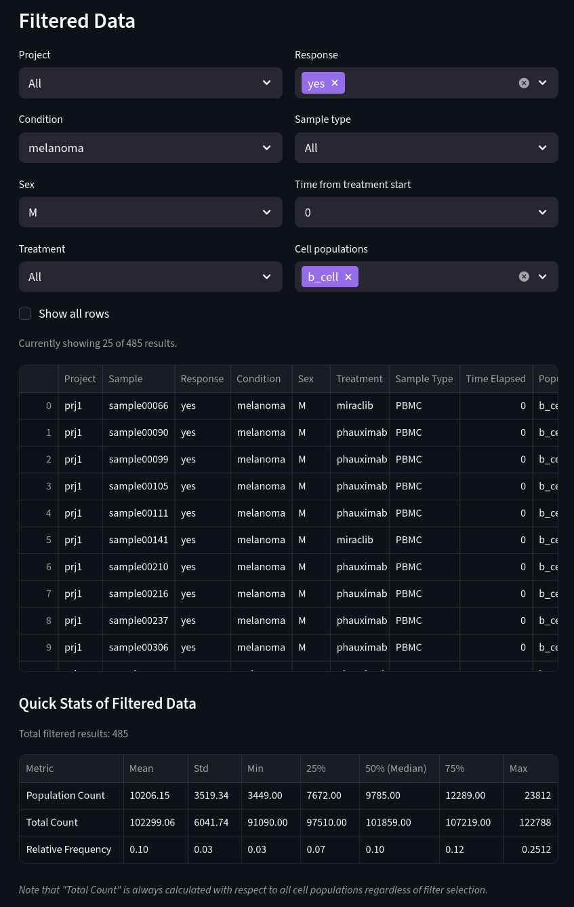

# AI Disclosure
Some generative AI (Github Copilot) was used in the creation of this project for the sake of code syntax and logic optimization.

# Instructions
Run `setup.sh` to set up the Python environment and dependencies. This also starts a local Streamlit instance at http://localhost:8501/, which hosts the interactive dashboard.

# Files
`unit-tests.py`
- Set of unit tests to verify that functions from across the project are working as intended. It tests the following functions: `create_db()` from `database.py`, `calc_cell_frequencies()` from `summary.py`, `fetch_data()` and `distinct_values()` from `dashboard.py`. It also verifies that some database contents were able to be successfully created and populated.

`setup.sh`
- Shell file that creates a virtual environment and install dependencies, then runs `main.py` to set up the database and `dashboard.py` to start the dashboard.

`main.py`
- Main program file with a skeleton for additional features. Currently, it runs `database.py` and `summary.py` but is set up to be modularly compatible with future additions.

`database.py`
- Helper file that is responsible for creating a relational database from the given `cell-count.csv`. It checks for an existing table and replaces it if it exists, then dumps the contents of the CSV file into a table called "cell_counts". The schema enforces valid entries and consistent typing for each column. For example, "age' is "age INTEGER NOT NULL" to ensure that all data points are valid and integers. I set the primary key as "sample" because it is unique throughout the dataset. 
- For larger datasets and projects, as well as more complex analyses, it would be ideal to try to match primary keys across multiple tables to allow for joins and more complex analyses. Creating indexes to speed up queries would also be important to consider, but I did not find it necessary here. Furthermore, splitting the `database.py` file into more helper files could help with modularity and organization, especially if multiple pages or complex workflows were to be added.

`summary.py`
- Helper file that creates a new table -- "cell_frequencies" -- with "sample" (Sample), "total_count" (Total Count), "population" (Population), "count" (Population Count), and "percentage" (Relative Frequency) columns. It splits each sample into 5 entries, each corresponding to a cell population. Each sample-cell population entry also retains its number of cells and the total cell count of the overall sample. It also incorporates a new metric that measures the relative frequency of that cell population to the total number of cells in the sample.
- This table is committed to the database for use in the dashboard.

`dashboard.py`
- The dashboard makes use of Python and Sqlite as the backend and Streamlit for the frontend. A few helper functions are included to improve the efficiency of query fetching and value retrieval. Also included is a function to render tables with a checkbox to restrict the number of rows loaded in by default. This greatly helps performance. 
- This is the largest and most complex file in the project. For more complex applications or when scaling up, it would be better to move certain elements to their own functions for the sake of organization. I did not find it necessary here. 

### Addressing Part 2:

- The Data Overview section addresses Part 2 of the assignment, importing "cell_frequencies" from the database to the file as a Pandas dataframe, which then gets rendered as an interactive Streamlit table. 
- The Filtered Data section addresses Parts 3 and 4 of the assignment. A new dataframe is dynamically created depending on what the user filters using the dropdown selectors. 

### Addressing Part 3:

- Selecting the above filter settings allows you to compare differences in cell population relative frequencies of melanoma patients receiving miraclib who respond versus those who do not respond, including only PBMC samples.
- The following box plot visualizes population relative frequenties between responders and non-responders for each immune cell population. The Statistics by Population chart relies on a Mann-Whitney U test to determine whether the distributions between each cell population's relative frequencies in responding and non-responding groups is statistically significant (p < 0.05) or not. Both the plot and the table are dynamically generated in response to the above filters.

### Addressing Part 4:

- The filtering options also support subset analysis. Above identifies all melanoma PBMC samples at baseline (Time 0 from treatment start) from patients who have been treated with miraclib.
- To determine how many samples were from each project, select the specified project filter and check either "Currently showing X of Y results" or "Total filtered results". As these values update depending on the chosen filters, they should be accurate.
- To determine how many subjects were responders/non-responders, adjust the response filter to include only "no" or only "yes", and refer to the currently-shown number of results or total filtered results metric.
- To determine how many subjects were males/females, adjust the response filter to include only "F" or only "M" and refer to the metrics mentioned above to see the total. 

### Considering Melanoma males, what is the average number of B cells for responders at time=0? Use two significant figures.

- The average number of B cells for melanoma male responders at time=0 is 10206.15.